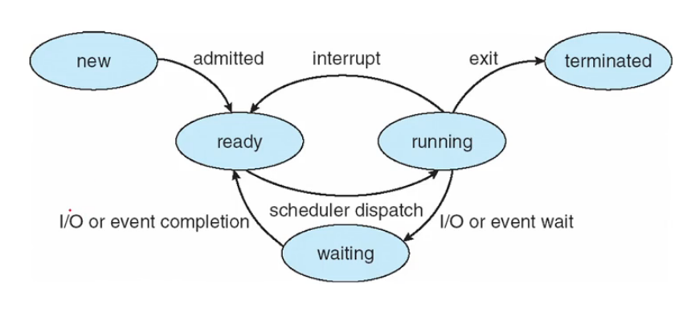

# 운영체제의 개념과 구조

프로세스 = 실행중인 프로그램

**복습**
컴퓨터의 구조

cpu <- Memory에서 명령어를 FETCH, 실행

일반적인 구조
```
CPU <-> Memory <-> Hard Disk
[실행]  [프로세스]    [ex) a.out]
```
메모리의 계층...
- Text section
    - 실행가능한 코드
- Data section
    - 전역 변수
- Heap section
    - 프로그램이 진행 중에 동적으로 할당된 메모리

```
MAX STACK
    .
    .
    .
    HEAP
    DATA
    TEXT(CODE)
0
```
C언어를 예시로 확인해보자
```c
#include<stdio.h>
#include<stdlib.h>

int x;
int y=15;
int main(int argc, char *argv[]){
    int *values;
    int i;
    values = (int *)malloc(sizeof(int)*5);
    for(int i=0;i<5;i++)
        values[i] = i;
    return 0;
}
```
```
argc, argv
stack : main, values
~
heap : malloc(5개)
uninitialized data
initialized data
text : for 문
```
> size 명령어로 a.out을 확인해보자
>> text data bss dec hex filename 이 나타난다.

프로세스의 상태
1. New : 프로세스가 생성
2. Running : 명령어가 실행
3. Waiting : 프로세스가 이벤트 발생 전까지 기다림
    - I/O 작업이 끝날 때 까지 기다리기 등등
4. Ready : 프로세스가 프로세서에 할당되기 기다림
5. Terminated : 프로세스가 종료됨
    - exit(), return;



## 프로세스를 관리
PCB(Process Control Block), TCB(Task Control Block)을 사용

운영체제에서 각 프로세스가 지니는 특징을 PCB에 저장.
- PCB는 특정 프로세스와 관련된 많은 정보를 가지고 있다.
    - Process state(위에서 언급한 프로세스 상태)
    - Program counter 
        - 이전에 언급한 IR(명령어 레지스터)은 PC에 저장된 메모리주소에서 명령어를 가져온다.
    - CPU registers : IR(명령어 레지스터), DR(데이터 레지스터)
        - CPU 레지스터와 PC를 context라고 한다
    - CPU-scheduling information
    - Memory-management information
    - Accounting information
    - I/O status information

위의 정보를 토대로 PCB를 정의하고 os가 PCB를 관리한다.

process는 `single thread of excution`하는 하나의 프로그램이다.

프로그램은 싱글 `스레드`로 실행한다.\
프로그램 내에서도 동시에 여러 스레드가 실행될 필요가 있다. 

그래서 스레드(매우 가벼운 프로세스)를 실행한다.

프로세스 내의 스레드와 스레드의 차이점
- 스레드는 프로세스에서 single thread를 실행한다는 것에 착안하여 만든 개념.
- 정말 가벼운 하나의 작업을 하는 프로세스를 스레드라고 지칭.

프로세스를 여러개를 돌리는 것 보다 스레드(하나의 작업만 하는 프로세스)를 여러개 돌리는 것이 더 효율적이다. = 요즘에도 Multi Tread로 프로그램을 한다.

## 멀티 프로그래밍의 목적
- 동시에, 병렬적으로 프로세스를 진행
- CPU을 최대로 사용하기

시분할의 목적
- CPU 코어를 자주 프로세스간에 switch하기 위해서
- 유저는 각 프로그램이 동시에 실행되는 것같은 효과를 본다.
    - 시분할을 하기 위해서 Scheduling Queue를 사용

Scheduling Queue
- 프로세스가 실행될때 `ready queue`로 들어간다.
    - 프로세스가 ready되고 CPU 코어의 실행을 기다린다.(`wait queue`)
- 실행(running)한 다음에 ready queue 상태로 돌아간다.

Context Switch
- context of process, PCB에서 사용하는 프로세스.
- 만약 interrupt가 발생하면
    - 시스템은 현재 진행중인 context(PCB)를 저장한다.
    - 다시 그 프로세스가 복원되도록 저장.
    - 다른 프로세스의 상태를 복원

fork를 통해서 프로세스가 생성
- 트리와 같게 부모 프로세스, 자식 프로세스가 존재.

좀비 프로세스 : 자식 프로세스가 부모 프로세스보다 먼저 종료

고아 프로세스 : 부모 프로세스가 자식 프로세스보다 먼저 종료


